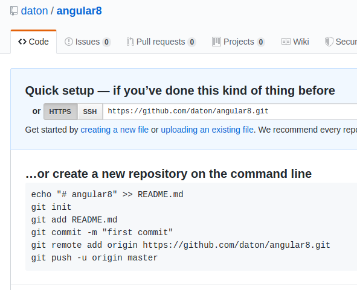
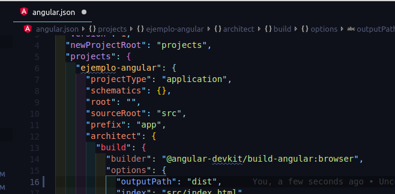

# Producción angular en páginas github

## Creacion del proyeto
Primero creamos el proyecto con la línea
```
npm i angular-cli-ghpages --save-dev
```

Posteriormente creamos en nuestra cuenta de angular  un repositorio cuyo nombre puede ser
 el que sea, pero se recomienda una sola palabra y sin espacion o 
 si son dos unirlas con guin medio
 
 
 Ahora abrimos el proyecto de angular recien creado desde linea de comandos desde nuestro
 visual code . Dentro de visual code abrimos la terminal  y ejecutamos el proyecto
 con el comando **ng serve**  y lo visualizamos en el la ruta **http://localhost:4200** 
<br><br>
Posteriormente en otra terminal dentro de visual code  en una nueva ventana
 iniciamos git a partir de nuestro repositorio creado en github:
 ```
 git init;
 git remote add origin https://github.com/daton/angular8.git;
 ```
 Posteriormente iniciamos github pages en esa misma terminal con la
 siguiente linea
 ```
 npm i angular-cli-ghpages --save-dev
 ```

Posteriormente y MUY IMPORTANTE en tu proyecto de angular  busca
 el archivo **angular.json** y en el atributo **build** deja el valor de 
 **output-path** a sólo **dist**
 
 El siguiente paso es poner el produccion primero, igual en la terminal de tu proyecto de angular
  escribe el comando:
  ```
 ng build --prod --base-href /angular8/
```

En donde **angular8** es el nombre de tu repositorio tal como le pusiste en github
<br>
Una vez que termine igual en la misma ventana de la terminal pones
```
npx ngh --no-silent
```
Te pedira tu usuario y password de github, se los proporcionas y listo,
ya puedes consultar tu pagina en tu repo de github.
